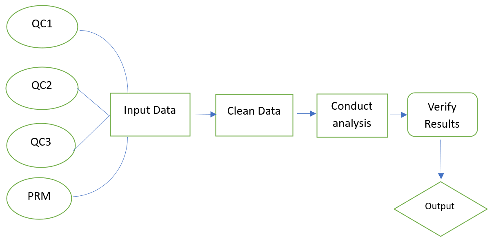

## EDS-214-Project

### "Replication of Figure 3 from 'Chemistry of stream water from the Luquillo Mountains"

From Stephan Kadonoff

###### skadonoff\@ucsb.edu

### Overview

This repository contains the original sample collection data, a description of and the code itself utilized to reproduce this analysis, and finally, a quarto document containing the output graph of the modeled data.

#### How to Replicate

To replicate, you will need to download [this](https://portal.edirepository.org/nis/mapbrowse?packageid=knb-lter-luq.20.4923064) data package from the Environmental Data Initiative (Scahefer et al.), as well as ensure that you have installed the tidyverse, here, zoo, paletteer, and janitor packages. Below is an example of the general workflow for this project. Further details on specific steps may be found below.

### Data

Relevant data from the above listed data package (Schaefer et. al) was utilized for this analysis. Specifically, since the goal of this project was only to replicate a single figure, the only relevant data-sets are the QuebradCuenca1-Bisley, QuebradaCuenca2-Bisley, QuebradCuenca3-Bisley, and RioMameyesPuenteRoto csv files. These were stored in the "data" repository of this project.

### Analysis Scripts

The two key Script files were the "moving_average_script.R" and the "plotting_scripts.R", both of which may be found in the Analysis Scripts subfolder, within the "scripts" folder located in the main project repository. Run the code within each script, beginning with "moving_average_script.R" to add an additional data column to each of the dataframes for analysis (BQ1, BQ2 etc...). Once each data frame has utilized the rolling_average_script, then you may visualize the various graphs via the ggplot functions found within the "plotting_scripts.R" file.

### Supporting Code

Supporting code was created to read-in the different CSV files, as well as to clean the data-frames for easier analysis and verification. These can be found in the "Cleaning_Code" subfolder, with the "joined_sites" and "project_work" R files serving as the main location for these codes.

### Outputs

The final deliverable of this project, a quatro doc, containing the final figure, may be located within the "Deliverables" folder in the Project repository (WORKING)
